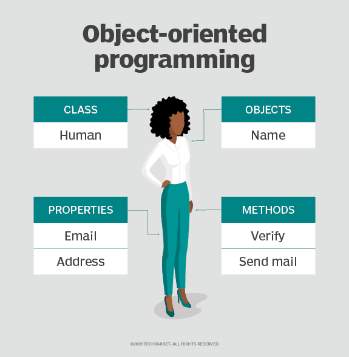
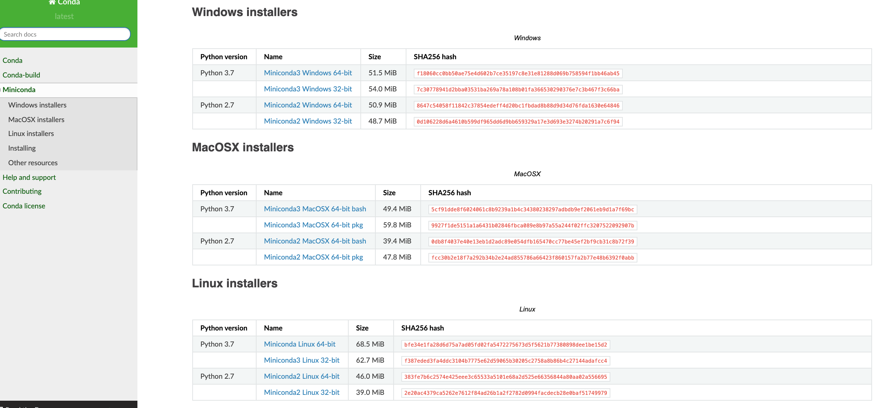
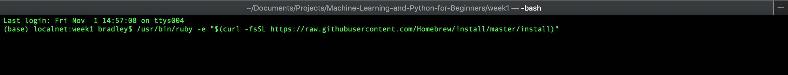
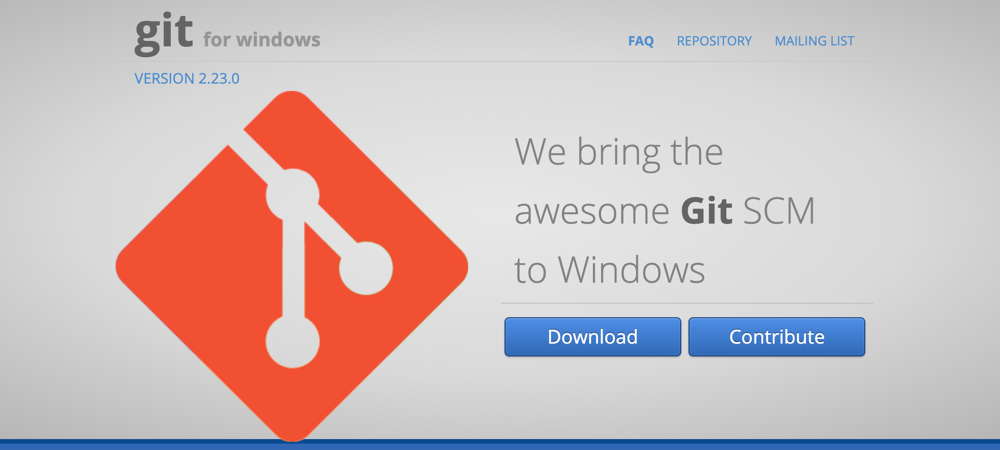
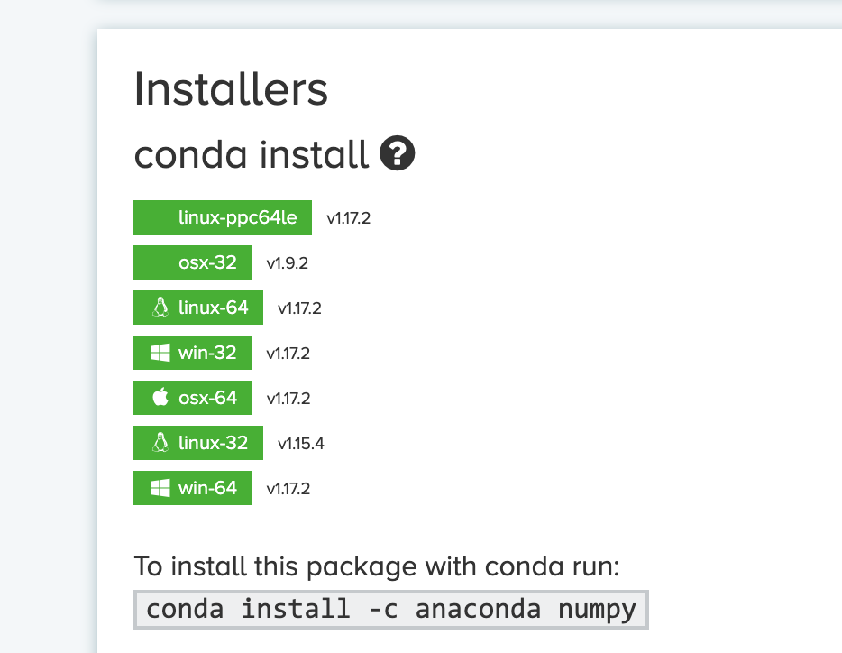
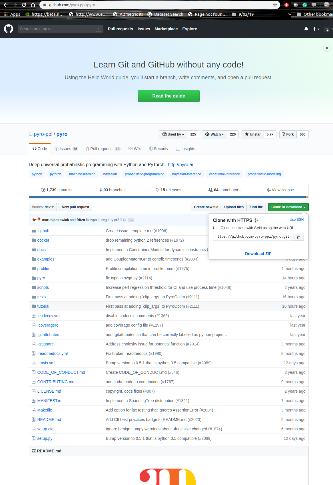
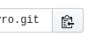
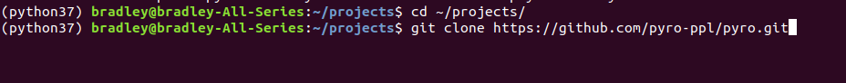

# :star::snake: Python: What is it and how do I get it? :star::snake: #


### Some history ###

Python was conceived in the late 1980s by [Guido van Rossum](https://en.wikipedia.org/wiki/Guido_van_Rossum) at Centrum Wiskunde & Informatica (CWI) in the Netherlands and its implementation began in December 1989.

Its popularity in recent years has [skyrocketed](https://stackoverflow.blog/2017/09/06/incredible-growth-python/), due to its ease of use, growing number of libraries and readability. Disclaimer: Python is not the only language out there, in fact there are hundreds, if not thousands, each designed, and optimized, with a particular utility in mind; Pythons is readability and flexibility. Python is one of the easiest languages to pick up and use, but it may not be the best language for the task that you wish to conduct - it is important to keep this in the back of your mind.

Python belongs to a family of languages called *Object Orientated languages*, that is languages organised around objects, rather than "actions" and logic. This is an over simplified reduction, but if you would like more information about the most popular programming languages paradigms, [click here](http://www.eecs.ucf.edu/~leavens/ComS541Fall97/hw-pages/paradigms/major.html) 

The following image is useful for understanding what an OOP is:



[Source](https://searchapparchitecture.techtarget.com/definition/object-oriented-programming-OOP) 

You can see from the image that the language uses *objects* to *encapsulate* properties of the *object* you care about. In this case, the *class* of the *object* is human. Each human object has a name and when a human is initiated, it has a number of fixed *properties*, or *attributes*, in this case an Email and home address. Each human can do many things, or *methods*, in this case they can verify messages and then send the message via Email, and, or a home address.

We can also *inherit* or create base objects for other objects to inherit from. You can think of inheritance with the following analogy. You have a Parent, who has a Child. The Child inherits genetic traits from the Parent and any further Child, of the Child of the Parent, will inherit from Parent and the Child. In this case, you don't have to redefine certain attributes, or methods. Instead they are inherited from one object to the next. There may come a time when evolution strikes and a child develops a new method, or attribute. Well that is easy to handle, we just add those things to the class that inherited from its predecessors. We will see examples of this in later weeks. 


## Installing Python (3+ and 2.7+) ##

To make our lives easier, we are going to install Python using package management software, which will simplify your lives drastically. In particular we are going to leverage something called [Anaconda](https://www.anaconda.com/). 

### Using the Command Line ###

Linux / Mac based machines use UNIX for the command line - this is what you use in the terminal. This is different to MS-DOS used by Windows based devices. 
You interact with DOS when you use CMD Prompt or similar utilities.

To navigate the terminal, or prompt I've provided a table below with limited set of very heavily used commands. 

| Linux/Mac Command  | Windows command | Description                                                                                                                                                                                                                                                                                                                       |
|--------------------|-----------------|-----------------------------------------------------------------------------------------------------------------------------------------------------------------------------------------------------------------------------------------------------------------------------------------------------------------------------------|
| ls                 | dir             | Prints the contents of the given directory.                                                                                                                                                                                                                                                                                       |
| cd `<add path>`    | cd `<add path>` | Changes to the location specified by the string in  `<add path>`. I.e `<add path> = ~/Downloads/`  so you would type ` cd ~/Downloads ` to go to the downloads folder. `cd ~` will take you to the  `home`  directory, that is where your documents, downloads, photos, etc folders are. `cd ..` will move you up one directory.   |
| mkdir `<add name>` | md `<add name>` | Makes a directory relative to the directory in which  it is called. I.e `<add name> = 'project`.   The `mkdir project` creates a new folder called `project` in the current dir.                                                                                                                                                      |
| pwd                | pwd             |  Prints out the path for the current directory that you are in.                                                                                                                                                                                                                                                                   |

There are many other well used commands, but I do not want to overwhelm you. If you'd like to find out more
[click here](http://www.informit.com/blogs/blog.aspx?uk=The-10-Most-Important-Linux-Commands) for UNIX systems and [click here](https://www.digitalcitizen.life/command-prompt-how-use-basic-commands) for DOS systems. 

### Installing miniconda, a light weight version of Anaconda. ###

First [click here](https://docs.conda.io/en/latest/miniconda.html) to go to the download page for miniconda, you will see the following page:




Download the `Python 3.<a_number>` `64-bit` Mac, or Linux, or Windows file. It depends on which operating system (OS) your machine is using.

### Installing Miniconda on Mac/ Linux ##

Linux users can put their feet up for a few seconds, as we need an additional package manager for MAC OS based systems, called `Brew`, 
this will make our lives much easier later on, if you use a Mac. 

#### Additional step for Mac ####
Open up the terminal (on MAC press `cmd` + `space` and then type `terminal` and hit `enter`.)

Within the terminal window type:
```ruby
/usr/bin/ruby -e "$(curl -fsSL https://raw.githubusercontent.com/Homebrew/install/master/install)"
```
and then hit `enter`.

see image below:


Brew will then proceed to install.

Then we want to install `git`, which is a piece of software used for version control, we will talk more about this later on. 

Type the following in the terminal:

```shell
brew install git
```
and wait for the procedure to complete. 

#### Additional step for Linux ####

To install `git` on a Linux machine, specifically for `Ubuntu`, we type the following commands, after each command hit enter:
 ```shell
 sudo apt-get update
 sudo apt-get install git
```
and wait for the procedure to complete. 

### Installing Miniconda ###

Still inside the terminal locate where the `miniconda` file has been downloaded to, from the steps above, and in the terminal type:

```shell 
cd <location of file>
```
where `<location of file>` is a PATH string, for example `<location of file> = /Users/bradley/Downloads/Miniconda4082892.sh`

Then type
```shell
bash Miniconda<press tab key>
```
*Note: The `tab` key is really useful as it will autocomplete, provided there is something in the vicinity of where you are searching, the file name or command.*

Follow the prompts (agree to the T&Cs) and state that you want conda to add something to your `.bashrc` file. 

Close the terminal and reopen another terminal window. 

### Installing Miniconda on Windows ##

To install Miniconda on Windows, we locate the downloaded file, from the step above and run the installation. 
When the Miniconda installation prompts you for a save location, keep it as the default location, i.e whatever it states in the save location, unless you know what you are doing. 
Do not check any additional options, other than terms and conditions, unless you know what you are doing.

Once completed, go the the Windows start menu and type Anaconda, open Anaconda prompt.

#### Additional step ####

For Windows machines, please install Git for windows, [click here](https://gitforwindows.org/). 

Click the download button on the webpage:


Open the downloaded file and run the installation. Save in the default location, i.e whatever it states is the save location.

`git` will then be installed on your machine. 

### Set-up Python Environment ###

In this section we are now going to install the relevant libraries, these instructions will be the same for all operating systems,
provided you are using `the terminal` in Linux/ Mac machines, and `Anaconda prompt` in Windows. 

Within our terminal, or prompt, window we type the following `conda` command to set up a new Python environment. 

```shell
conda create -n <env_name> python=<python version number>
```
where, for example, `<env_name> = python37` and `<python version number> = 3.7`. Environment name can be any string, but labelling it
`python37` makes it clear for you. `<python version number> ` can be any valid Python version number i.e `2.7`, `3.` etc. 

If we label our env name something else and want to know which Python version it is, we can type the following command:
```shell
conda list -n <env_name>
```

and then check what number it says next to the `python` entry. 

To activate a given environment we type the following command:

```shell
conda activate <env_name>
```

You should now see, appended to the front of the line entry, on the terminal/ prompt: (<env_name>`), which states that you 
are now in that given environment. To switch to another environment simply type the same command above and change the `<env_name>`.


###  How to get the required libraries ###
If our library is a standard `Python` library then it will be hosted on `pip` or `conda`.

**NOTE:** Before searching for the package, we first want to make sure that we are in the right `environment`. 
That is, if you want to install this package in the `python37` environment that we created above, ensure that you have activated it and are in that environment with `conda activate python37`. 
Then copy the `pip` or `conda` install instruction and hit `enter`. See below. 


Given a library, the easiest way to find the required `pip` or `conda` name for the library is to go to your favourite search engine
and search either:
```
conda install <package name>
```




click the link that reference that takes you to the `anaconda.org` page. Copy the given `conda install` command
and paste that into your Anaconda prompt (Windows), or
terminal (Mac/Linux). 

Or for `pip`. 
```
pip install <package name>
```
click the first `pypi` link you see, then copy the `pip install` command and paste that into your Anaconda prompt (Windows), or
terminal (Mac/Linux). 


#### An example: Installing PyTorch CPU ####

PyTorch is a very useful library for deploying more sophisticated Machine Learning algorithms, we will use it in the future. However, 
as the installation instructions vary across machines, I will walk through how to install it on Linux, Mac and Windows.

###### On Windows and Linux ######

Type the following command into your terminal window:

```shell
conda install pytorch torchvision cpuonly -c pytorch
```
then hit `enter` and type `y`
###### On Mac ######

```shell
conda install pytorch torchvision -c pytorch
```

##### Installing the rest of the required packages ####
For ease, I've provided a list of commands to install all the required libraries for the first few weeks in the `requirements.txt` file.


Simply download the file from the Github repo [click here](https://github.com/bayesianbrad/Machine-Learning-and-Python-for-Beginners/blob/master/week1/requirements.txt)
and then go to the location where it has been downloaded via the terminal, or Anaconda prompt. 
Ensure that you are in the right environment and run:
```shell
pip install -r requirements.txt
```
and all the packages will be installed. 

## Installing a Python library from Github ##

This process is not always generic, but it should be similar for each Python install from `github`. We are now going to leverage `git`. 

Let's say we find a library that we need to use online, for example `pyro` [click here](https://github.com/pyro-ppl/pyro). 
We need to make sure that there is a `setup.py` file contained within the repo. 

For the `pyro` library there is one, wahooo :star:!

Within the terminal, we move to a location where we are happy to copy the library too. For example `cd ~/projects/` ,or we make a new dir.

Next we clone the `github` repo in the location.

On the `github` repository page we press the green `Clone or download` button (see picture).



For convienice, we can talk about using SSH offline, you want to make sure when the box that appears opens that it says **Clone with HTTPS**. 
Press the paste button at the end of the string that ends with `.git`:


Go back to the terminal and type (to paste the repo use right click the mouse, or use `cmd + v` for Mac, `shift+ctrl+v` for Linux, `ctrl + v` for Windows. ):

```shell
git clone https://github.com/pyro-ppl/pyro.git
```




Wait for the repo to be copied, *cloned*, from github and then type:
`cd pyr<press tab>`
then hit `enter`

type `pwd` and hit `enter` to ensure you are in the given directory of the library, it should read `<something>/pyro`. 


Once in the `pyro` directory, esnure that the right conda environment is activated and then type the following commands, hitting enter after each command:
```shell
git checkout master
pip install .
```

This will then triggered the `setup.py` file, which will then install the given library to your conda environment. 

You can now move to a completely different folder and use that library, you do not have to remain in the folder.

**Important Note:** When installing libraries in this way you should not necessarily install the `master` branch, you typically want to install
the latest stable version. To find that, you would typically have to look through the github page of that library. 


